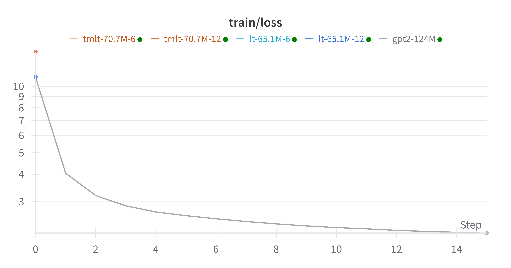

# Timestep-Modulated Looped Transformer (TMLT)

This repository is the official implementation of [On Expressive Power of Looped Transformers: Theoretical Analysis and Enhancement via Timestep Encoding](https://arxiv.org/abs/2410.01405).
In this paper, we establish the approximation rate of Looped Transformers by defining the modulus of continuity for sequence-to-sequence functions. This reveals a limitation specific to the looped architecture. That is, the analysis prompts the incorporation of scaling parameters for each loop, conditioned on timestep encoding.

### Setup

```shell
pip install torch numpy transformers datasets tiktoken wandb tqdm
```

### Training on WikiText-103

Train a standard GPT model following [nanoGPT](https://github.com/karpathy/nanoGPT):
```bash
python train.py config/train_gpt2.py
```

Train a Looped Transformer with or without timestep encoding:
```bash
python train.py config/train_lt.py
python train.py config/train_tmlt.py
```

Experimental results validate the theoretical results, showing that increasing the number of loops enhances performance, with further gains achieved through the timestep encoding.

<div style="text-align: center; margin: 20px 0;">
  
</div>


## Acknowledgement

- [nanoGPT](https://github.com/karpathy/nanoGPT)
- [DiT](https://github.com/facebookresearch/DiT)
