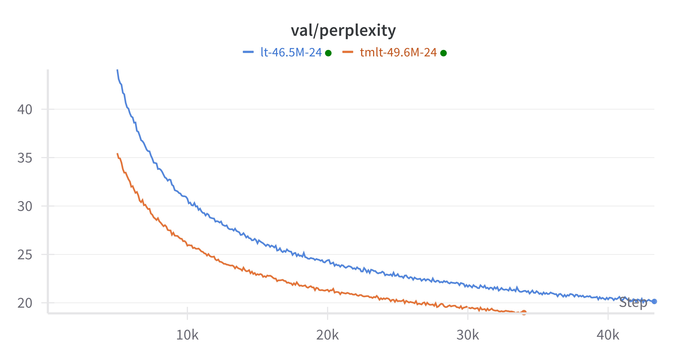

# Timestep-Modulated Looped Transformer (TMLT)

This repository is the official implementation of [On Expressive Power of Looped Transformers: Theoretical Analysis and Enhancement via Timestep Encoding](https://arxiv.org/abs/2410.01405).

- :pencil: **Approximation rate, universal approximation theorem, and time-modulated architecture**
- :chart_with_upwards_trend: Implemented with **timestep encodings**, supported by experiments

### Setup

```shell
pip install torch numpy transformers datasets tiktoken wandb tqdm
```

### Training on WikiText-103

Train a Looped Transformer with or without timestep encoding:
```bash
python train.py config/train_lt.py
python train.py config/train_tmlt.py
```

Experimental results validate the theoretical results, showing that increasing the number of loops enhances performance, with further gains achieved through the timestep encoding.

<div style="display: flex; justify-content: center; gap: 10px; margin: 10px 0;">
  
  
</div>


## Acknowledgement

- [nanoGPT](https://github.com/karpathy/nanoGPT)
- [DiT](https://github.com/facebookresearch/DiT)
